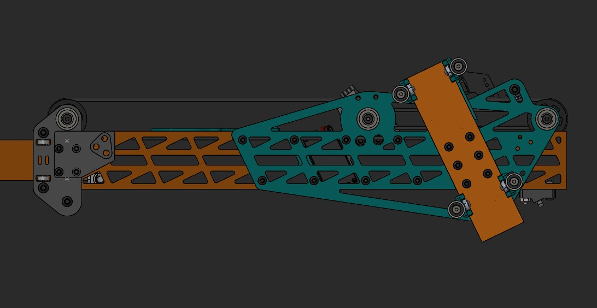
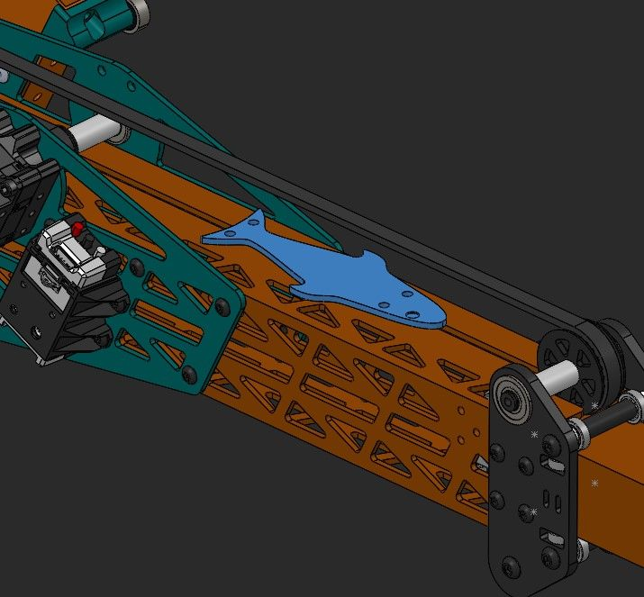
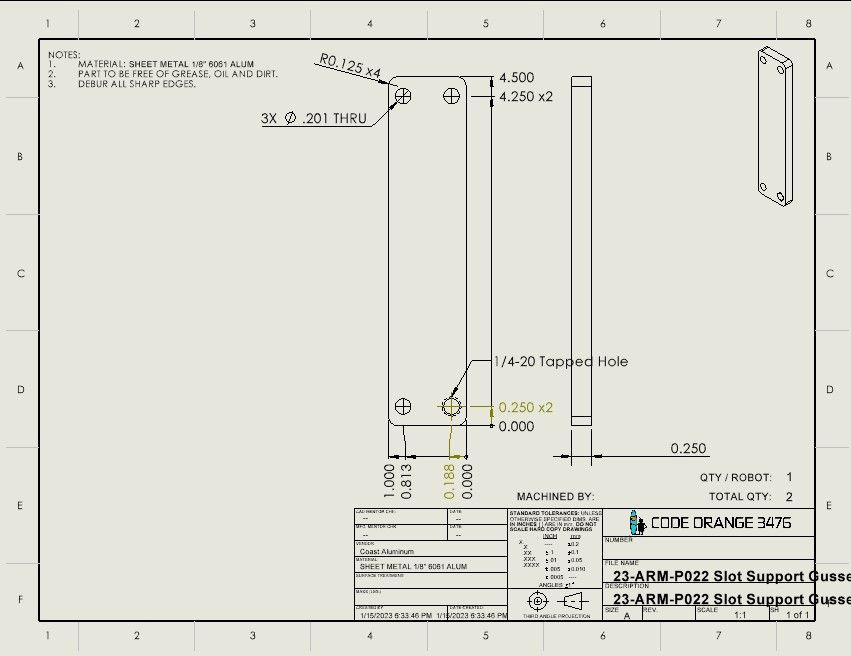
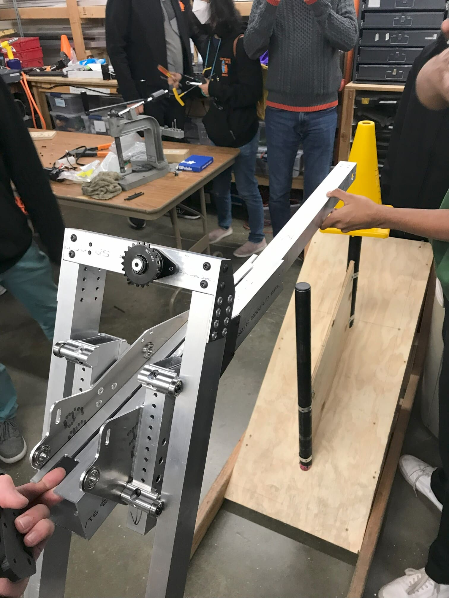
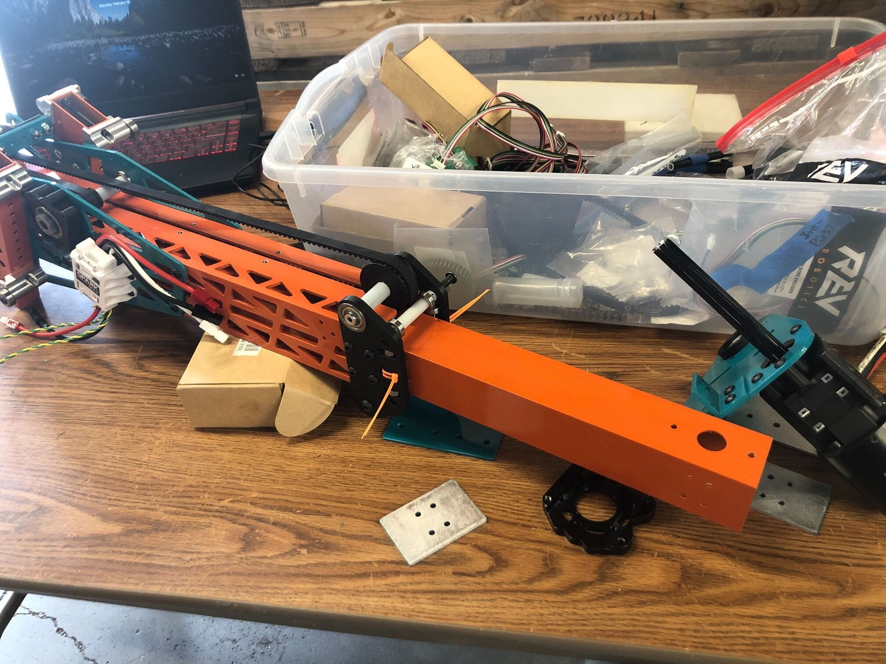
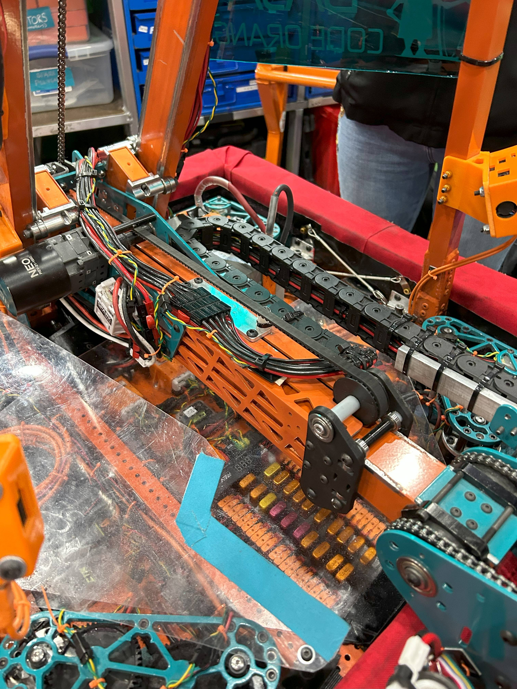

In high school, I was part of an award winning [FIRST Robotics Competition](https://www.firstinspires.org/robotics/frc) team, [Team 3476: Code Orange](https://www.teamcodeorange.com/). In the 2023 season, I designed a belt-driven telescoping "arm" that could extend up to 19 inches in 0.5 seconds.

Here is our reveal video:



## Prototyping
Each season starts with prototyping, so I experimented with lots of different mechanisms for this telescope. One of them used a constant force spring for extension:
<video width="75%" controls autoplay muted loop>
  <source src="/projects/frc-arm/arm3-prototype.mp4" type="video/mp4">
  Your browser does not support the video tag.
</video>
We eventually decided against this design because although fast, it only allows full extension or retraction, with no intermediate positions. We required the system to have precise extension, extend and retract in less than a second, and be lightweight.

## Design
After debating on constant force springs, lead screws, and pneumatic cylinders, I decided on a belt-driven design. With this, I had to figure the very complex geometry for this robot. Given the constraints of the robot size and the desired extension, I really learned how to make nice, detailed sketches.

Some other highlights of this design include the see-through pocketing, which took me almost 5 straight hours one night.

And a fish, for fun!

## Manufacturing
I directed the manufacturing of this arm, making all the drawings for parts, giving them to the manufacturing team, and keeping track of a manufacturing list. Here are some photos of the process:

<!---->

## Competition - Pit Crew!
At competition, I was selected to be on the 6-man pit crew because of my dedication and expertise in robot design. My pit crew experience was intense. When the robot came back  broken from a match, the pit crew often had mere minutes to repair it before the next match. Stress was intense, communication was key, and time was always running out. Through this experience, I learned how to analyze mechanisms quickly, work effectively with my pit crew mates, and screw a bolt in at lightning speed. That 2023 Season, Code Orange made it to the Einstein Field, where the top 24 teams out of thousands worldwide compete for the top spot.

