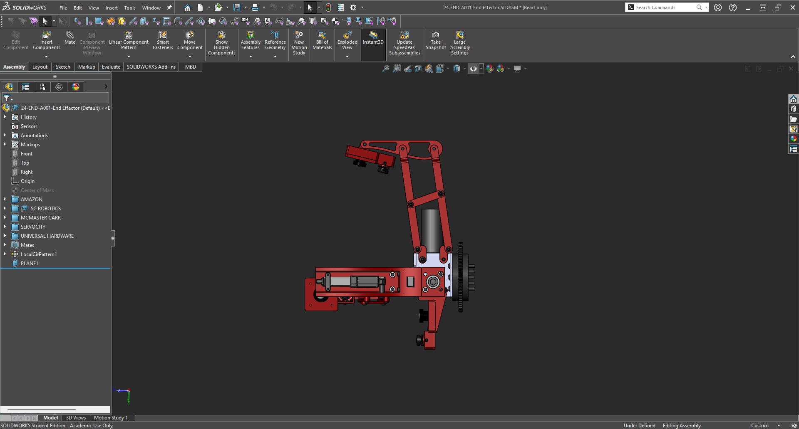

I built a 6 degree of freedom robotic arm for my mars rover team, competing in the University Rover Challenge. Leading it from design to the field, it was a tremendous success.

This arm is the most difficult and time-consuming project that I have ever attempted, but also the most rewarding. The requirements were mechanically and electrically challenging, and the design and implementation proved to require countless iterations.

I'll talk about this project in three phases: design, manufacturing, and testing. But first, a video:



## Design

{}
From requirements, napkin sketches, and material selection to mechanism design and revision, take a brief overview of the design process for this arm.
{}

### Overall Design

Looking back to the robotic arm I designed in the previous year, I realized that it lacked one thing: mobility. It had only five degrees of freedom, and the two most important axes had limited rotational range. This caused us difficulty in completing some tasks in the University Rover Challenge.

To increase mobility, this new arm would have six degrees of freedom, with brushless motors at every axis, eliminating the linear actuators and brushed motors we had used before. The design was inspired by one that a previous team member had modeled.

### Electronics

For the electronics, the most difficult thing to select were the brushless motors. To summarize, I chose to run with a 24V system as opposed to the 12V system I had run on last year to allow for higher torque density and more optimized thermals. I chose to run with brushless motors for a greater level of precision and efficiency, despite the more difficult controls required. I also created a spreadsheet calculating a ballpark of the expected torque required for each motor and gearbox combination at every axis. All this led to the selection of several EC Flat Maxon motors, which worked great!

### Gearboxes

At each axis, a gearbox was used to produce the right amount of torque. I used strain wave gearboxes at the first three axes, which sustain the highest moment, and I used custom cycloidal gearboxes for the final three axes. These gearboxes were designed by a previous member but never successfully prototyped. I revised and tested them.

### Materials

For the materials selection, I had to consider that my machining capability essentially consisted of a CNC router and 3D printers, along with some other simple machines like bandsaws, drill presses, and bench grinders.

Consequently, I chose the main frame to be designed from 6061-T6 aluminum, which is lightweight, sturdy, and easily machinable. I performed FEA on critical components to ensure safety under expected loads with a factor of safety.

## Manufacturing

## Testing